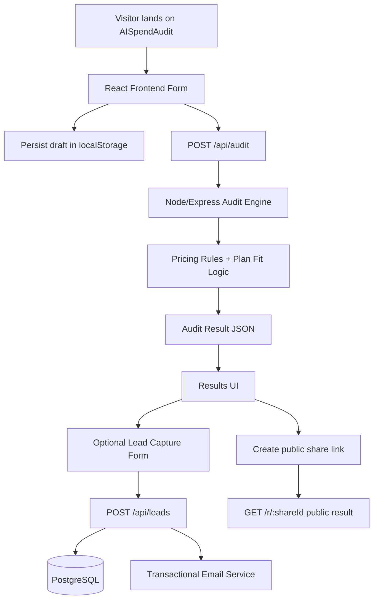

# Architecture

## System Diagram (Mermaid)

## Data Flow

1. User enters tools, plans, spend, seats, team size, and primary use case in the frontend form.
2. Frontend stores draft form state locally so refresh does not lose progress.
3. Frontend sends normalized audit input to backend `POST /api/audit`.
4. Backend applies deterministic pricing and recommendation rules (not AI-generated math).
5. Backend returns per-tool recommendations and aggregate savings numbers.
6. Frontend renders hero savings plus explanation lines per tool.
7. If user wants to save/export, lead form submits to backend `POST /api/leads`.
8. Backend stores lead + audit snapshot in PostgreSQL and sends confirmation email.
9. Backend returns share ID; public endpoint exposes sanitized report only.

## Why This Stack

- React + TypeScript for fast iteration and maintainable UI state.
- Node + Express for straightforward API routes and predictable deployment.
- PostgreSQL for structured audit/lead records and share-link retrieval.
- Deterministic rule engine for finance-readable recommendations.

## Abuse Protection Choice

AISpendAudit uses a honeypot field on lead capture plus a simple in-memory per-IP rate limit on API routes. I chose this before hCaptcha because the product is meant to show value before adding friction, and the first abuse risk is automated lead/report spam rather than high-risk account takeover. At larger scale, I would move the rate limit to Redis or the hosting provider edge layer so limits work across multiple server instances.

## If This Needed 10k Audits/Day

- Add Redis cache for static pricing and common recommendation paths.
- Queue non-critical work (email, analytics writes) with background workers.
- Split audit engine into pure service module with benchmark load tests.
- Add DB indexes on share ID and created-at fields; use read replicas.
- Add rate limiting at API gateway and per-IP abuse controls.
